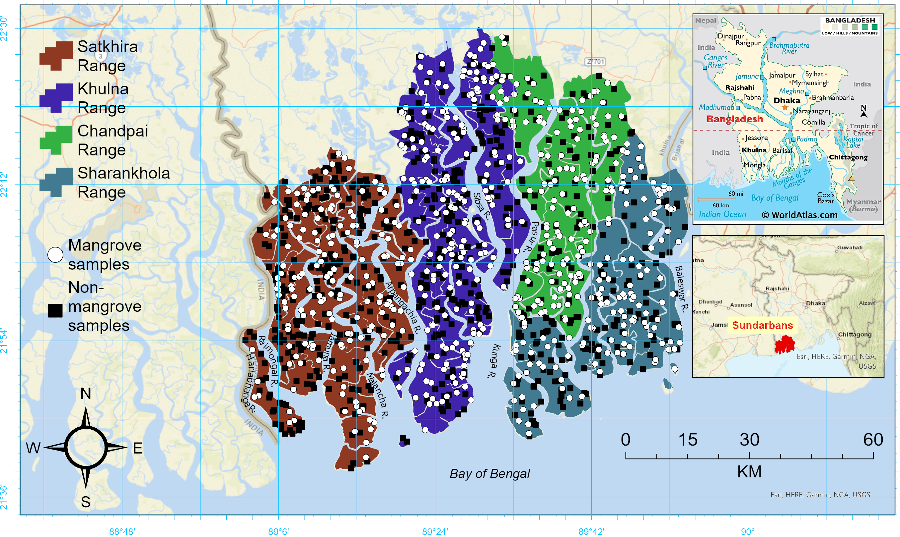
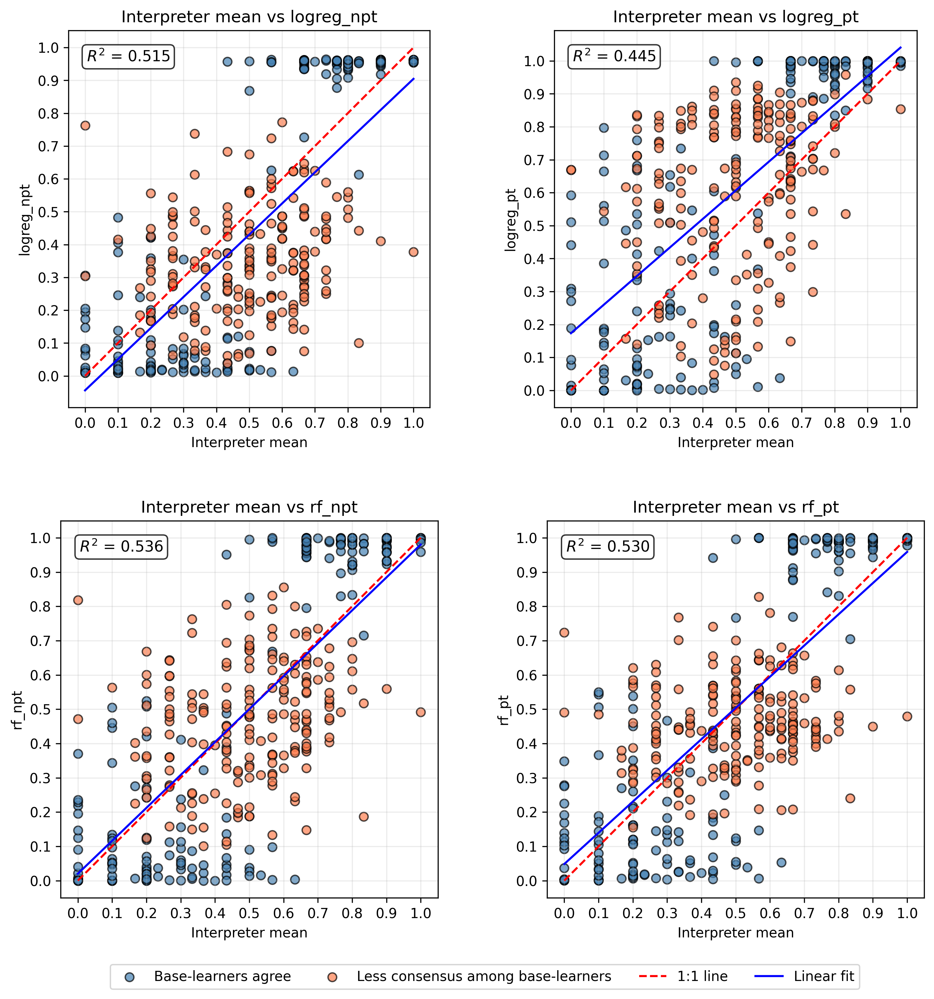

<div align="center">

# Accuracy is not certainty: 
# code for uncertainty-aware mangrove mapping to inform stakeholder decision making

[](https://www.python.org/)
[](https://earthengine.google.com/)
[](https://www.planet.com/nicfi/)



<sub>Study area: The Sundarbans mangrove forest and the BFD ranges are shown on the study area map. Mangrove and non-mangrove sample points that were used for this study are illustrated. The Sundarbans, one of the world’s largest continuous mangrove forest and a demanding test case (for our study) for evaluating spatial uncertainty in environmental maps. The region has experienced sustained canopy degradation driven by altered freshwater flows, land-use pressures, and salinity intrusion. In this context, identifying where model predictions are reliable (and where they are not) is important for stakeholders for effective monitoring and decision-making..</sub>

</div>

---

## This repository contains the code accompanying the paper:
**Islam et al. (2025)**  
*Accuracy is not certainty: using model agreement and human judgment to assess spatial uncertainty in high-resolution mangrove mapping*

---

## Overview

Environmental maps derived from remote sensing and machine learning are often interpreted as definitive representations of reality. However, high classification accuracy does not necessarily imply spatially reliable knowledge. Accuracy metrics are often taken for granted as sufficient justification for producing and using binary maps, even though they summarize performance globally and do not reveal where predictions are stable or where they are unreliable. This gap is rarely interrogated in the literature, yet it is critical for decision-making in spatial contexts.

This repository implements a workflow that reframes classification outputs as **probabilistic representations of epistemic stability**, using:

- multiple base learners  
- stacked generalization  
- spatially explicit measures of model agreement  

Rather than asking *“what is the predicted class?”*, this work asks:

> **Where are predictions stable, and where are they fundamentally uncertain?**

The approach demonstrates that **continuous ensemble probabilities encode structured gradients of certainty**, where:
- probabilities near 0 or 1 indicate strong model agreement and high interpretability  
- intermediate probabilities indicate disagreement among models and ambiguity in human judgment  

---

## Key contributions

- Introduces a **model-pluralistic framework** for spatial uncertainty assessment
- Uses **base learner disagreement (standard deviation)** as a proxy for epistemic uncertainty, that is, uncertainty due to limited knowledge, which appears as disagreement among multiple plausible models trained on the same data
- Demonstrates that **stacked probabilities capture structured uncertainty gradients of base learners**
- Compares model-derived uncertainty with **independent human interpretation**
- Moves beyond accuracy metrics toward **decision-relevant uncertainty mapping**

Although demonstrated for mangrove mapping, this framework is not domain-specific. It can be generalized to other mapping problems where uncertainty itself carries decision value. For example, in damage mapping, building-level damage probabilities can guide prioritization of field assessment and resource allocation; in disaster risk zoning, probability surfaces can represent gradients of perceived or modeled risk rather than fixed boundaries; in snow depth mapping, estimates can be paired with uncertainty bounds to inform hydrological forecasting and water resource planning. In each case, the objective shifts from producing a single definitive map to representing where predictions are stable and where knowledge remains uncertain.

---

## Does model uncertainty aligns with human interpretation?



*Fig1: Scatterplots of interpreter mean values versus model-predicted probabilities for four stacked generalization configurations (Stacking-LogReg-NPT, Stacking-LogReg-PT, Stacking-RF-NPT, Stacking-RF-PT).*

Stacked probability maps encode disagreement among base learners as probabilistic uncertainty. To evaluate whether these probabilities correspond to meaningful uncertainty in real-world interpretation, we compared model predictions against independent human interpretation scores.

Across all stacking configurations, model probabilities show a strong positive relationship with interpreter confidence. Pixels with high model agreement align closely with interpreter judgments near the extremes of absence or presence, while pixels with weaker agreement exhibit greater dispersion around the 1:1 relationship.

---

## Spatial variability in classification represented by stacked generalized map


*Fig2: a. Spatial distribution of mangrove probability derived from stacked generalization (Random Forest, no feature pass-through), with b. zoomed examples and c. comparison to Global Mangrove Watch (GMW) and d. MAXAR high-resolution imagery. The values indicates probability range from 0 (dark gray; very likely non-mangrove) to 1 (pale yellow; very likely mangrove).*

The final probability map represents a continuous surface of mangrove likelihood, where values range from 0 (very likely non-mangrove) to 1 (very likely mangrove). This configuration was selected due to its strong alignment with high-confidence human interpretation while remaining interpretable.

High-probability regions correspond primarily to closed-canopy mangrove areas, whereas lower and intermediate values are concentrated in more heterogeneous environments, particularly in western portions of the forest with open canopy structure.

Zoomed examples reveal that intermediate probabilities (≈0.3–0.7) are not randomly distributed, but occur systematically along geomorphological features such as river confluences, tidal creeks, and drainage channels. These areas frequently correspond to mixed or transitional vegetation conditions.

Compared to the Global Mangrove Watch (GMW) binary product, the continuous probability map better resolves non-mangrove areas and captures fine-scale landscape structure visible in high-resolution MAXAR imagery.

These patterns show that uncertainty is spatially organized and closely linked to environmental heterogeneity, and provide actionable information for targeted validation and monitoring.

---
## Repository Structure
```
├── preprocessing/        # Image preprocessing and masking (NICFI Planet data)
├── feature_engineering/  # Spectral indices + CCDC (Continuous Change Detection and Classification) coefficient generation
├── modeling/             # Base learner training (RF, XGB, SVC, KNN, Logistic)
├── stacking/             # Stacked generalization (super learner models)
├── uncertainty/          # Base learner SD and agreement analysis
├── visualization/        # Figures (e.g., SD vs probability relationships)
└── notebooks/            # Analysis and figure generation notebooks
```

---

## Workflow

The repository follows a structured pipeline:

1. **Preprocessing**
   - Apply masking to remove clouds, haze, and tidal effects
   - Generate seasonal composites

2. **Feature Engineering**
   - Compute spectral bands and vegetation indices
   - Extract temporal features using CCDC (Continuous Change Detection and Classification; a temporal segmentation algorithm) coefficients

3. **Model Training**
   - Train multiple base learners:
     - Random Forest
     - XGBoost
     - Support Vector Classifier
     - KNN
     - Logistic Regression
   - Use spatial cross-validation (BlockCV, ~25 km blocks)

4. **Stacked Generalization**
   - Combine base learner predictions into continuous probability surfaces
   - Evaluate stacking with different meta-learners and configurations

5. **Uncertainty Quantification**
   - Compute **per-pixel standard deviation** across base learners
   - Identify regions of:
     - agreement (low SD)
     - disagreement (high SD)

6. **Analysis of Epistemic Stability**
   - Understanding base learner variability with stacked probabilities
   - Examine how uncertainty is distributed spatially

7. **Human Interpretation Comparison**
   - Evaluate whether model uncertainty aligns with human-perceived ambiguity
   - Use blinded interpreters assigning continuous confidence scores

---

## Methods Highlights

- **Spatial cross-validation**  
  BlockCV with ~25 km spatial structure to account for autocorrelation

- **Model ensemble design**  
  Multiple base learners reflecting different inductive biases

- **Stacked generalization**  
  Integrates predictions while preserving disagreement signals

- **Probability calibration (evaluated)**  
  Platt scaling, isotonic regression, and beta calibration

- **Uncertainty representation**  
  Standard deviation across base learners used as a proxy for epistemic uncertainty

---

## Data

- NICFI PlanetScope basemaps (4.77 m resolution) multi-temporal image collection and derived spectral indices and CCDC features

#### Base learner inference maps
- `projects/ee-islamkm/assets/baselearner_knn_mngrv`
- `projects/ee-islamkm/assets/baselearner_logreg_mngrv`
- `projects/ee-islamkm/assets/baselearner_rf_mngrv`
- `projects/ee-islamkm/assets/baselearner_svc_mgrv`
- `projects/ee-islamkm/assets/baselearner_xgb_mgrv`

#### Stacked generalization inference maps
- `projects/ee-ashrafulcuetbd/assets/stacking_logreg_npt_prediction`
- `projects/ee-ashrafulcuetbd/assets/stacking_logreg_pt_prediction`
- `projects/ee-ashrafulcuetbd/assets/stacking_rf_npt_prediction`
- `projects/ee-ashrafulcuetbd/assets/stacking_rf_pt_prediction`

These assets store model-derived probability surfaces used for uncertainty analysis, comparison with interpreter scores, and generation of final probability maps.
(Data access may depend on external platforms such as Google Earth Engine.)

---

## Reproducibility Notes

- Spatial cross-validation is repeated multiple times for stability
- Hyperparameter tuning performed using Optuna
- Results emphasize consistency across model configurations rather than single-model performance

---

## Citation

If you use this code, please cite:
Islam, K. M. A., Kilbride, J. B., Murillo-Sandoval, P. J., & Kennedy, R. E. (2025).
Accuracy is not certainty: using model agreement and human judgment to assess spatial uncertainty in high-resolution mangrove mapping.
